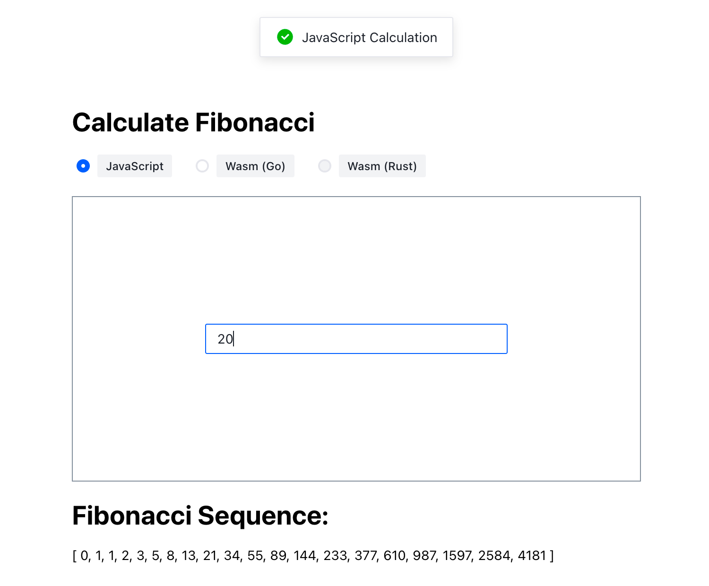
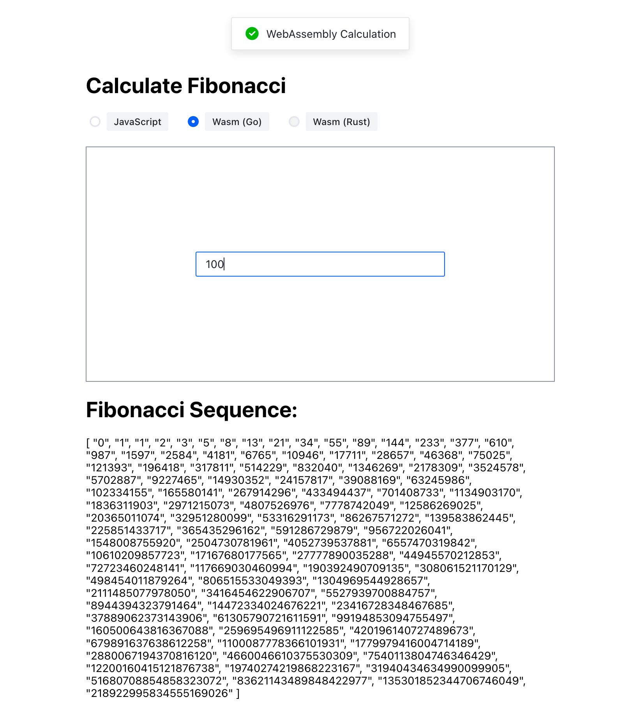

# wasm-demo

Use Go1.21 + Vue3 + Vite + Bun to complete the wasm example of calculating the Fibonacci sequence


## Project Setup

```sh
bun install
```

### Compile and Hot-Reload for Development

```sh
bun run dev
```

### Type-Check, Compile and Minify for Production

```sh
bun run build
```


## Screenshot

### Get calculation results from js



### Get calculation results from go-wasm


